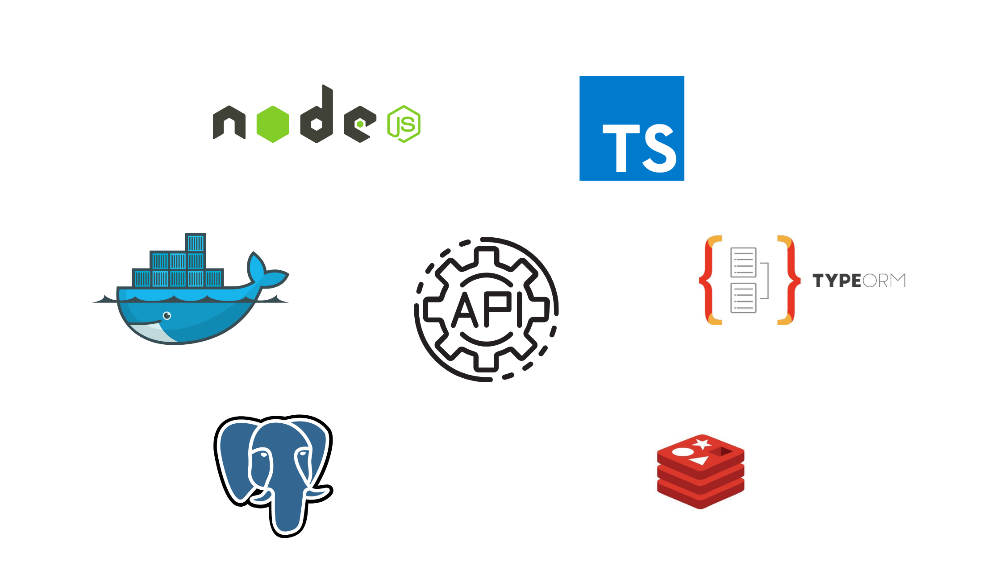

<div id="top"></div>


<div align="center">

  ![GitHub repo size][GitHub repo size-shields]
  ![GitHub language count][GitHub language count-shields]
  [![Forks][forks-shield]][forks-url]
  [![Stargazers][stars-shield]][stars-url]
  [![Website][Website-shields]][Website-link]
  [![LinkedIn][linkedin-shield]][linkedin-url]

</div>


<!-- PROJECT LOGO -->


<div align="center">
  <a href="https://github.com/thiagobcoelho25/udemy-api-docker-redis">
    
  </a>

  <h3 align="center">udemy-api-docker-redis</h3>

  <p align="center">
    API project with clean code and TDD!

</div>

<!-- TABLE OF CONTENTS -->
<details>
  <summary>Table of Contents</summary>
  <ol>
    <li>
      <a href="#about-the-project">About The Project</a>
      <ul>
        <li><a href="#built-with">Built With</a></li>
      </ul>
    </li>
    <li>
      <a href="#getting-started">Getting Started</a>
      <ul>
        <li><a href="#prerequisites">Prerequisites</a></li>
        <li><a href="#installation">Installation</a></li>
      </ul>
    </li>
    <li><a href="#usage">Usage</a></li>
    <li><a href="#contributing">Contributing</a></li>
    <li><a href="#author">Author</a></li>
  </ol>
</details>

---


<!-- ABOUT THE PROJECT -->
## About The Project

<!--[![Product Name Screen Shot][product-screenshot]](https://example.com)-->

<!--There are many great README templates available on GitHub; however, I didn't find one that really suited my needs so I created this enhanced one. I want to create a README template so amazing that it'll be the last one you ever need -- I think this is it.

Here's why:
* Your time should be focused on creating something amazing. A project that solves a problem and helps others
* You shouldn't be doing the same tasks over and over like creating a README from scratch
* You should implement DRY principles to the rest of your life :smile:

Of course, no one template will serve all projects since your needs may be different. So I'll be adding more in the near future. You may also suggest changes by forking this repo and creating a pull request or opening an issue. Thanks to all the people have contributed to expanding this template!

Use the `BLANK_README.md` to get started.-->
<h4>🚧 Project under construction... 🚧</h4>

<p align="right">(<a href="#top">back to top</a>)</p>


### Built With


* [Node.js](https://nodejs.org/en/)
* [Postgresql](https://www.postgresql.org/)
* [Docker](https://www.docker.com/)
* [Typescript](https://www.typescriptlang.org/)
* [Typeorm](https://typeorm.io/)
* [Redis](https://redis.io/)

<p align="right">(<a href="#top">back to top</a>)</p>


<!-- GETTING STARTED -->
## Getting Started

<!--This is an example of how you may give instructions on setting up your project locally.
To get a local copy up and running follow these simple example steps.
-->
<h4>🚧 Project under construction... 🚧</h4>

### Prerequisites

<!--This is an example of how to list things you need to use the software and how to install them.
* npm
  ```sh
  npm install npm@latest -g
  ```
-->
<h4>🚧 Project under construction... 🚧</h4>

### Installation

<!-- _Below is an example of how you can instruct your audience on installing and setting up your app. This template doesn't rely on any external dependencies or services._

1. Get a free API Key at [https://example.com](https://example.com)
2. Clone the repo
   ```sh
   git clone https://github.com/your_username_/Project-Name.git
   ```
3. Install NPM packages
   ```sh
   npm install
   ```
4. Enter your API in `config.js`
   ```js
   const API_KEY = 'ENTER YOUR API';
   ```
-->
<h4>🚧 Project under construction... 🚧</h4>

<p align="right">(<a href="#top">back to top</a>)</p>


<!-- USAGE EXAMPLES -->
## Usage

<!--Use this space to show useful examples of how a project can be used. Additional screenshots, code examples and demos work well in this space. You may also link to more resources.

_For more examples, please refer to the [Documentation](https://example.com)_
-->
<h4>🚧 Project under construction... 🚧</h4>

<p align="right">(<a href="#top">back to top</a>)</p>


<!-- CONTRIBUTING -->
## Contributing

Contributions are what make the open source community such an amazing place to learn, inspire, and create. Any contributions you make are **greatly appreciated**.

If you have a suggestion that would make this better, please fork the repo and create a pull request. You can also simply open an issue with the tag "enhancement".
Don't forget to give the project a star! Thanks again!

1. Fork the Project
2. Create your Feature Branch (`git checkout -b feature/AmazingFeature`)
3. Commit your Changes (`git commit -m 'Add some AmazingFeature'`)
4. Push to the Branch (`git push origin feature/AmazingFeature`)
5. Open a Pull Request

<p align="right">(<a href="#top">back to top</a>)</p>


<!-- AUTHOR -->
## Author

[<br><sub>@Thiagobcoelho25</sub>](https://github.com/thiagobcoelho25)

<!-- Your Name - [@your_twitter](https://twitter.com/your_username) - email@example.com -->

<p align="right">(<a href="#top">back to top</a>)</p>


<!-- MARKDOWN LINKS & IMAGES -->
<!-- https://www.markdownguide.org/basic-syntax/#reference-style-links -->
[forks-shield]: https://img.shields.io/github/forks/thiagobcoelho25/udemy-api-docker-redis.svg?style=for-the-badge
[forks-url]: https://github.com/thiagobcoelho25/udemy-api-docker-redis/network/members

[stars-shield]: https://img.shields.io/github/stars/thiagobcoelho25/udemy-api-docker-redis.svg?style=for-the-badge
[stars-url]: https://github.com/thiagobcoelho25/udemy-api-docker-redis/stargazers

[linkedin-shield]: https://img.shields.io/badge/-LinkedIn-black.svg?style=for-the-badge&logo=linkedin&colorB=555
[linkedin-url]: https://linkedin.com/in/thiagobcoelho25
[product-screenshot]: images/screenshot.png

[GitHub repo size-shields]: https://img.shields.io/github/repo-size/thiagobcoelho25/udemy-api-docker-redis?style=for-the-badge

[GitHub language count-shields]: https://img.shields.io/github/languages/count/thiagobcoelho25/udemy-api-docker-redis?style=for-the-badge

[Website-link]: https://github.com/thiagobcoelho25/udemy-api-docker-redis

[Website-shields]: https://img.shields.io/website?down_color=292929&down_message=404&style=for-the-badge&logo=github&up_color=292929&up_message=Commit&url=https%3A%2F%2Fgithub.com%2FRuanMiniguite%2FCommit-Message
